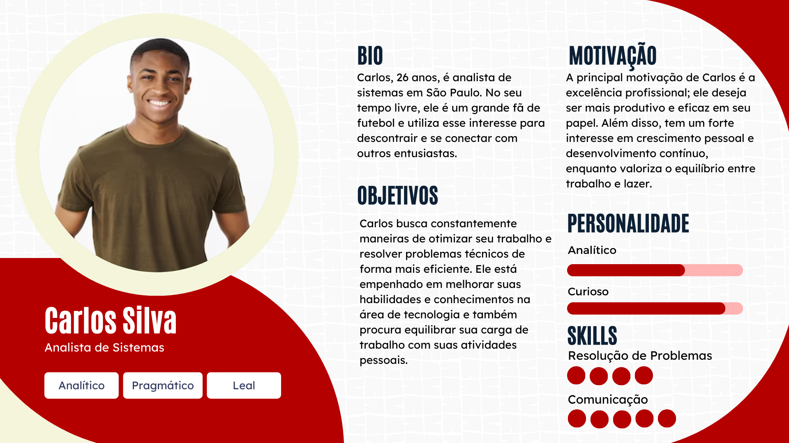
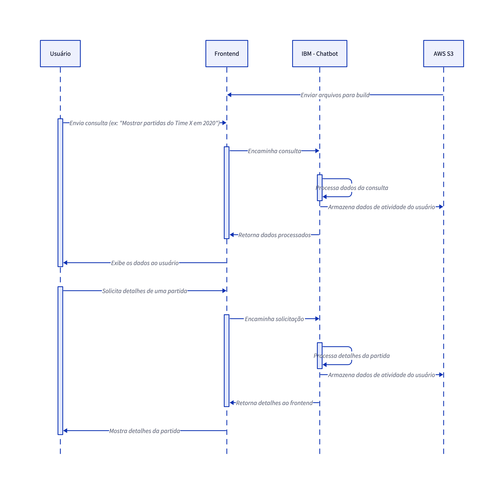

# ponderada_sala_s5

# Chatbot IBM

&emsp; Este projeto é um chatbot desenvolvido usando a IBM Watson Assistant. O objetivo é fornecer um assistente virtual capaz de responder a perguntas frequentes e oferecer suporte de maneira eficiente.

## Descrição do Projeto

&emsp; O chatbot foi projetado para responder a uma série de perguntas e fornecer informações úteis de forma automatizada.

## Persona

&emsp; O chatbot tem a seguinte persona que foi utilizada para identificar o problema a ser resolvido:

## Diagrama de Sequência

O diagrama de sequência abaixo ilustra o fluxo de interação entre o usuário e o chatbot:

